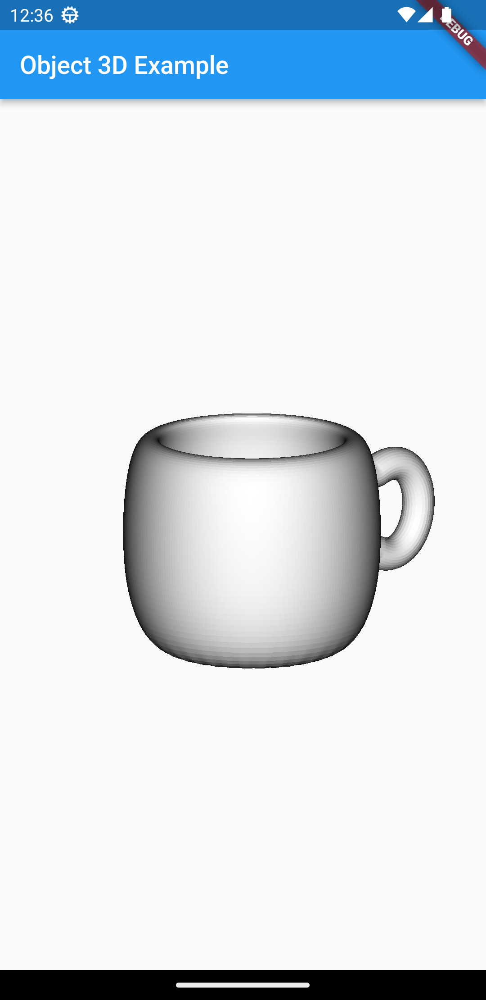
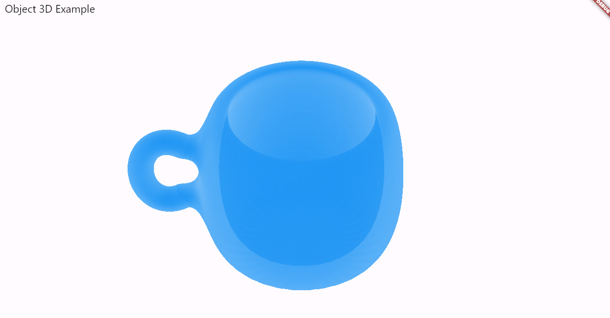

Basic copy of [flutter_3d_obj](https://github.com/hemanthrajv/flutter_3d_obj) with some changes
to make it more performant (such as parsing the object only once instead of every render and
grouping the vertices into one single draw call). It is also a null-safe library now.

## Preview

See more in [/screenshots](./screenshots/).

## Credits
- All credits for the initial library go to [hemanthrajv](https://github.com/hemanthrajv/flutter_3d_obj).
- Gesture feedback, optimization, and face coloring customization are thanks to [TheMaverickProgrammer](https://github.com/TheMaverickProgrammer) in collaboration with [DBL](https://github.com/InstrinsicAutomations).
